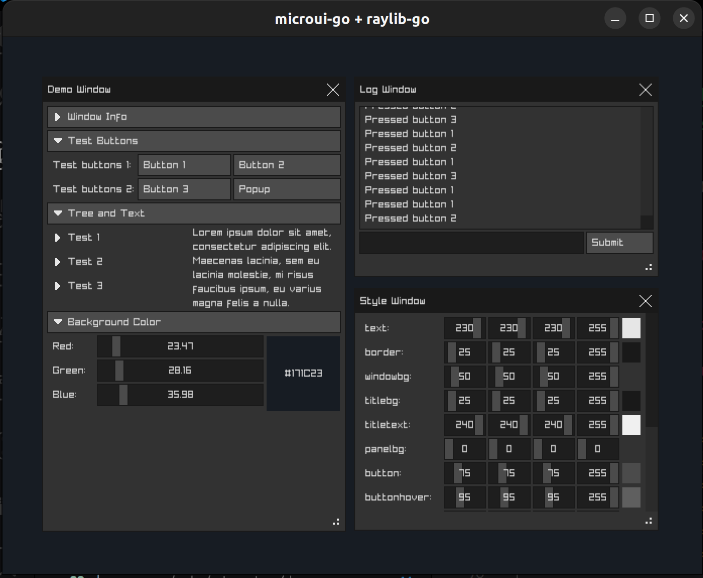

# 
A Go binding of [microui](https://github.com/rxi/microui), a *tiny*, portable, immediate-mode UI library written in ANSI C

## Features
* Tiny: around `1100 sloc` of ANSI C
* Works within a fixed-sized memory region: no additional memory is allocated
* Built-in controls: window, scrollable panel, button, slider, textbox, label,
  checkbox, wordwrapped text
* Works with any rendering system that can draw rectangles and text
* Designed to allow the user to easily add custom controls
* Simple layout system

## Example
